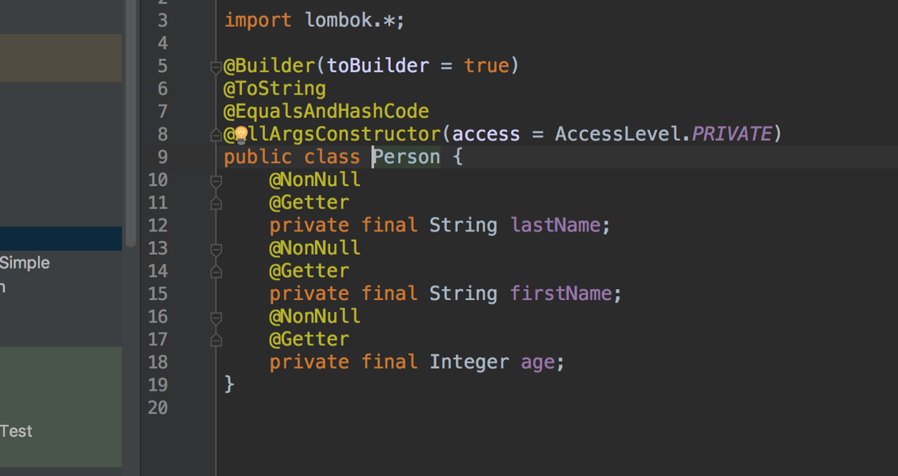

## Project Lombok

Four years ago when I first read about Project Lombok it sounded cool but never got a chance to use it anywhere.

After that never got a chance to use Project Lombok and at the same time, there were some people talking about Project Lombok using JDK’s experimental API’s and how it’s not ready for primetime.

Up until the last couple of months, I was against it and argued that modern day IDE’s are up to to the task of generating Getter/Setter/Builders and there really isn’t a need for Project Lombok.

Some of the folks who were using Project Lombok in their previous workplaces convinced us to use it in our new codebase and within no time I became a fan of Project Lombok for the simplicity it brought to the codebase. We started to experiment with primitive features like [Data](https://projectlombok.org/features/Data), [Builders](https://projectlombok.org/features/Builder), [slf4j](https://projectlombok.org/features/log), and [Constructors](https://projectlombok.org/features/constructor) and It became so easy and codebase looks so much cleaner compared to writing a getter/setter and a builder in a DTO.

When we have inheritance and builder, we have to do some fancy things, but otherwise, overall we are quite happy with it so far.

Project Lombok didn’t come up some upfront apprehensions about some of the features like [Equals](https://projectlombok.org/features/EqualsAndHashCode) especially when used with JPA, we still hear rumblings and we are treading with caution.

Project Lombok helped us to implement spring dependency injection by the constructor ( by the way that’s the [preferred](https://www.vojtechruzicka.com/field-dependency-injection-considered-harmful/) way to autowire dependencies ) once we decided to switch to it from the field dependency having Project Lombok really saved a lot of time, by just having annotations and converting existing fields to a constructor.

Overall I recommend Project Lombok for any Java project.